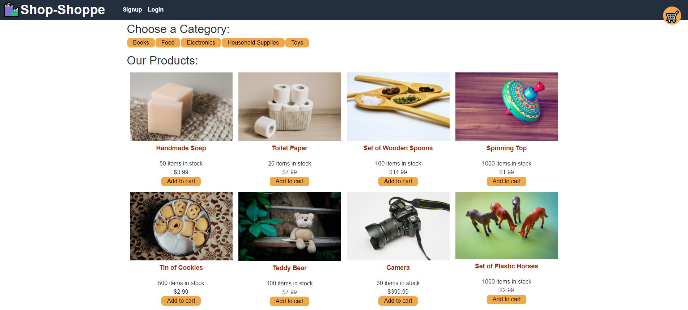
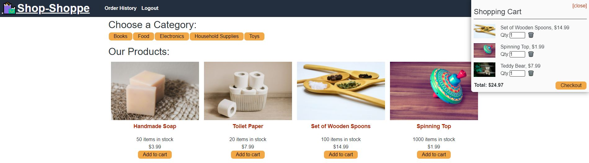

# Shop-Shoppe

## Description
A simple online shop and progressive web application that is perfect for your gifting needs.  Search products by category and add them to your cart.  Sign up and log in as a user to purchase them. Shop-Shoppe also includes offline functionality so you can access products and add items to your cart regardless of internet connection quality!

## **Table of Contents**
* [Screenshots](#screenshots)
* [Programs](#programs)
* [Website](#website)
* [Usage](#usage)
* [License](#license)
* [Questions](#questions)

## **Screenshots**

## **Programs**
* Apollo
* Apollo Server Express
* bcrypt
* Concurrently
* CSS
* Express
* GraphQL
* Heroku
* HTML
* IndexedDB
* JavaScript
* JSON Web Token
* JWT Decode
* MongoDB
* Mongoose
* Node
* nodemon
* React
* React Router
* Stripe

## **Website**
<a href="https://safe-cove-31802.herokuapp.com/" target="_blank">Shop-Shoppe</a>

## **Usage**
***Note: Using Chrome is highly recommended for the optimal experience***
1. To download the app version, open Chrome on your computer or smart phone
2. Visit the [Shop-Shoppe website](https://safe-cove-31802.herokuapp.com/)
3. At the top right of the address bar, click the install button which may be in the form of a `+` or a desktop computer icon with a downward-pointing arrow
4. Follow the onscreen instructions to install
5. Click the app icon on your desktop or smart phone home screen to open the app
6. View products by category and click *Add to cart* to add items to your shopping cart 
7. Sign up and log in as a user to purchase the products and checkout using Stripe
8. Encourage your friends to sign up!

## **License**
The project is distributed under the [Creative Commons License](https://creativecommons.org/publicdomain/zero/1.0/)

## **Questions**
Please contact me directly with any additional questions:
* [GitHub](https://github.com/ChristopherLawn)
* [Email](mailto:christopher.d.lawn@gmail.com)